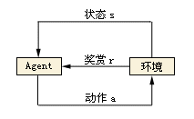

## 1. 引言


​		这是这个系列的第一篇，为什么会突然写这么一篇？这是因为公司最近搞了一个拳皇97 AI 大赛，各个程序摩拳擦掌，对于我来说有点难，不会玩，不懂客户端，试着写了下发现很难发出招式。本想用机器学习解决问题，奈何在公司网络限制，搞了两天，又由于还有正经工作，断断续续的，环境搭建不起来，简直是走一步三个坑，无奈只能自己手撸最简单的QLearning算法。

## 2. Qlearning 是什么

   强化学习在机器学习里面只是一个分支，QLearing 是强化学习的一个简单算法，可以理解为学程序时的最基础的冒泡排序，至于那些乱七八糟的定义，历史，百度吧，我也记不住，问题不大，解决问题优先。

## 3.Qlearning原理

​    本来想贴百度百科上来，不过那种官方的定义不够白话，有点类似文言文，有基础的一下就能看懂，没基础的看不懂。意义不大。

3.1首先看下强化学习的概念：



强化学习的概念可以理解为训练自己家的小狗上厕所，刚开始的时候小狗的天性肯定不会自己上厕所，在某次可能毫无意识的行为，他在一个你想让他上厕所的地方拉了，你果断上去给了个鸡腿，这种行为就叫奖励，而小狗会记住这种情况下主人给了他一个鸡腿，开心。在后面的时间，每当他做出正确的上厕所行为，你都会给一个鸡腿，这样就强化了他的记忆，小狗天性想要更多的鸡腿，因此下次想上厕所的时候就会从自己的经验中选择收益最高的行为，吸取历史经验以获得更多的鸡腿。如此循环就会强化记忆，这就是强化学习了。

3.2 看下QLearning 的算法原理：

​	QLearning 算法很简单，就是怎么储存记忆保存历史经验的的一种算法。QLearning使用最暴力的图表法，也可以理解动态规划，动态规划解决的问题就是action导致的状态转移，根据状态方程，并且查表进行优化。


​								<!--网上的图片，应该没人搭理我吧，侵权再删-->

比如上面这个图老鼠想要吃奶酪，但是不吃老鼠药。利用QLearning 怎么做呐？

对应一下各个术语：

environment 就是这个游戏

state 就是这个棋盘的状态 

action 就是向哪走 （上，下，左，右）

reward 就是获得的奶酪 获得小的奶酪

每次面临这种棋盘状态时，老鼠都会根据上次的经验走动，以获得最多的奶酪，并且不迟到毒药。

3.3 算法公式：


​	我猜是某个论文的图：

​	解释下：

​	Q(s，a) 表示你在做action之前的历史经验，获得说上一局的经验奖励

​	R(S,a) 表示这次做action之后获得的经验

​	maxQ'(s',a') 就是之前那么多次的历史经验的最大值，也就是历史上最有的那次选择

​	γ 表示 在采取最好的选择能对这种状态的提升

​	α 表示这次学习能学到多少。如果是1 的话就是乐观派，越小表示学习到的越少

​	greedy 没在公式内体现，表示多大的概率去探索

## 4.QLearing实现

​      1、定义状态：

​			棋盘的状态，什么地方有什么α

​		2、定义行为：

​			上，下，左，右

​		3、定义奖励：

​			一块奶酪 = +1
​			两块奶酪 = +2

​			一大堆奶酪 = +10（训练结束）

​			吃到了鼠药 = -10（训练结束）

​		4、算法公式

​				
Talk is cheap. Show me the code.代码主架构：

```
class QLearningTable:
    # 初始化
    def __init__(self, actions, learning_rate=0.01, reward_decay=0.9, e_greedy=0.9):

    # 选行为
    def choose_action(self, observation):

    # 学习更新参数
    def saveAction(self, s, a, r, s_):

    # 获得奖励
    def getReward(self, state):
    
```
选择action：
```
def choose_action(self, observation):
	def choosAction():
    rand = random.randint(0,99)
    if rand < 10:
        return 随机action
    else:
        return 在表中选择一个最大奖励的行为
```

奖励函数:

```
def getReward(self, state):
    if 奶酪数量 > 0:
        return 奶酪数量
    elif 吃到老鼠药:
        return -10
```
更新这次经验
```
def saveAction(self, state,action,nextState):
    reward = getReward(state)
    q(state,action) = q(state,action)  + a(reward+ r*(max(nextState,a)-q(state,action)))
```

上面是一些伪代码。只是为了让你看清到底是怎么回事，逻辑架构很清晰了，具体的实现网上一堆，公司内网的代码拿不出来，只能这样了，有不理解的可以私聊我。

## 5.总结：

这种文章好烦，写了好久，费力，算法很简单，那些公式不重要，只要记住，**根据历史经验去选择最优的行为，并且保留探索的机会**，看代码很清楚了。不懂的可以私聊我。

原创不易，求关注分享。