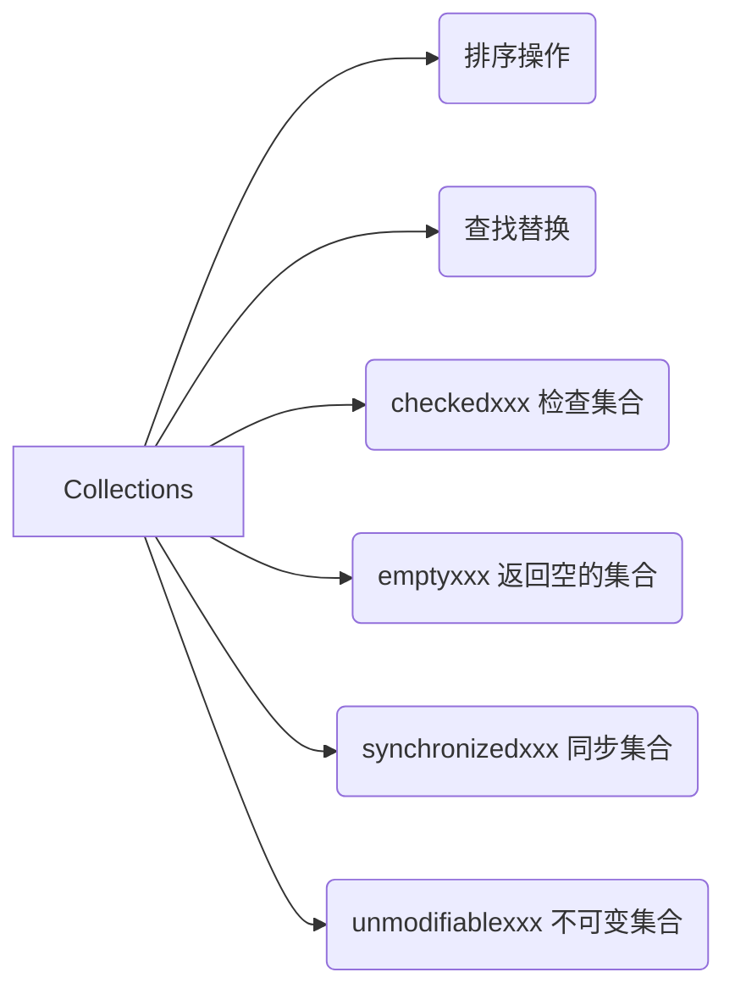

Java干货系列4


[TOC]

今天写一下 Collections，这是Java官方提供的针对集合类的工具类，也是在开发中的一把利刃，能帮我们解决很多开发中的问题，但是依然有很多人不会或者不了解其中的API，一起学习下。

## 1.Collectors，Collection，Collections傻傻分不清楚

​	

这可能是初学者遇到的问题，三个都和collect相关的。其中的分别也很简单。

​		1.Collectors 主要是用在java stream 中，是用来最后处理stream的，比如 Collectors.toSet()。	

​		2.Collection 是所有集合类的接口类，比如常用的Set,List,Map。

​		3.Collections 是Java官方的提供的工具类,今天重点来讲一下。

​    可以根据单词来记忆，Collectors 收集器。Collection 集合 。Collections 一堆集合操作。

​	

## 2.Collections中API的分类



#### 2.1 排序操作

| 方法声明                                                     | 功能描述                                               |
| ------------------------------------------------------------ | ------------------------------------------------------ |
| static <T>boolean addAIl(Collection <? super T>c,T... elements) | 将所有指定元素添加到指定的collection中                 |
| static void reverse(List list)                               | 反转指定List集合中元素的顺序                           |
| static void shuffle(List list)                               | 对List集合中的元素进行随机排序（模拟玩扑克中的“洗牌”） |
| static void sort(List list)                                  | 根据元素的自然顺序对List集合中的元素进行排序           |
| static void swap(List list,int i，int j)                     | 将指定List集合中i处元素和j处元素进行交换               |

比较简单，在用的时候看一下就会明白。

#### 2.2 查找替换

| 方法声明                                                     | 功能描述                                                     |
| ------------------------------------------------------------ | ------------------------------------------------------------ |
| static int binaryScarch ( List list,Object key)              | 使用二分法搜索指定对象在List集合中的索引，查找的 List集合中的元素必须是有序的 |
| static Object max(Collection col)                            | 返回给定集合中最大的元素                                     |
| static Object min (Collection col)                           | 返回给定集合中最小的元素                                     |
| static boolean replaccAll (List  list，Object oldVal,Object newVal) | 用一个新的newVal替换List集合中所有的旧值oldVal               |

#### 2.3 checkedxxx 检查集合

​	返回类型检查的集合，在对类型进行set 或者add的时候会做类型检查

   用法：

```
        ArrayList list = Lists.newArrayList();
        list.add(new Player("香菜"));
        //  返回的safeList 在add时会进行类型检查
        List safeList = Collections.checkedList(list, Player.class);
        //	此时会对类型进行检查，不是Player类型，抛出异常 java.lang.ClassCastException:
        safeList.add("xxx");
```

源码解析：

```
        public void add(E e) {
                    i.add(typeCheck(e));
                }
        E typeCheck(Object o) {
            if (o != null && !type.isInstance(o))
                throw new ClassCastException(badElementMsg(o));
            return (E) o;
        }
```
这一组的函数可以在开发中多用，尽量避免因为不小心或者因为多人合作的原因出现一些异常。
#### 2.4 emptyxxx 返回空的集合

​	这个操作有点骚，就是直接返回一个空集合，不能添加，不能删除，这个东西会有什么用呐？

用法：

```
      /**
     * 查询 和我同公会的好友
     */
    public List<Player> getSameUnionFriend(int roleId,int uid){
        //  如果当前玩家没有工会，直接返回空list
        if (uid == 0){
            return Collections.emptyList();
        }
        //  todo ....
    }

```

这样用的好处就是1.不用处理返回null的问题。2.不用新生成空的list，避免占用内存，因为返回的空list，整个应用共同用一个。你发现他的好处了吗？

源码解析：

```
public static final List EMPTY_LIST = new EmptyList<>();
```

#### 2.5 synchronizedxxx 同步集合

用法：

```
        ArrayList<Player> list = Lists.newArrayList();
        //  TODO;-----
        List<Player> synList = Collections.synchronizedList(list);
```

将传入的集合进行同步。解决线程同步问题。

源码：

```
 	final Object mutex;     // Object on which to synchronize
	public void add(int index, E element) {
            synchronized (mutex) {list.add(index, element);}
        }
```

这种方式相当于对集合进行了二次包装，在内部加了一把锁。

注意：但是这样的加锁方式会产生问题，如果是集合的单个操作是没有问题的，如果想同步集合状态下做一些非元操作是有问题的。还是要使用synchronize(list)。小心使得万年船。

#### 2.6 unmodifiableXxx 不可变集合

用法：传入的集合返回后不可以改变。

```
 		ArrayList<Player> list = Lists.newArrayList();
        //  TODO;-----
        List<Player> synList = Collections.unmodifiableList(list);
```

源码：

```
		public E set(int index, E element) {
            throw new UnsupportedOperationException();
        }
        public void add(int index, E element) {
            throw new UnsupportedOperationException();
        }
        public E remove(int index) {
            throw new UnsupportedOperationException();
        }
```

传入的集合不可以改变。因为包装类屏蔽了集合的方法，抛出了异常。

注意：只是不可以修改list的内容，但是可以修改list内元素的内容。比如下面：

```
		ArrayList<Player> list = Lists.newArrayList();
        list.add(new Player("香菜聊游戏"));
        List<Player> synList = Collections.unmodifiableList(list);

        Player player = synList.get(0);
        player.setName("香菜");
```

## 3.总结：

Collections 支持单个元素的除集合外提供的泛型操作。

如果你想同步集合，请用synchronizedxxx 。

如果你不想修改集合，请用unmodifiableXxx 。

如果你想使用空集合,请用emptyXxx。

如果你想保持集合纯净，请用 checkedxxx 。

刚开始学舞剑可能会伤到自己，但是你不学你永远不会用剑。技术没什么难的，难的是就怕你不知道。


