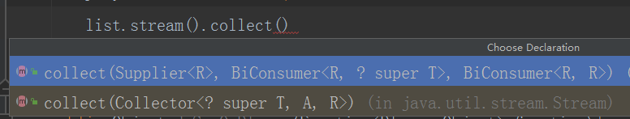
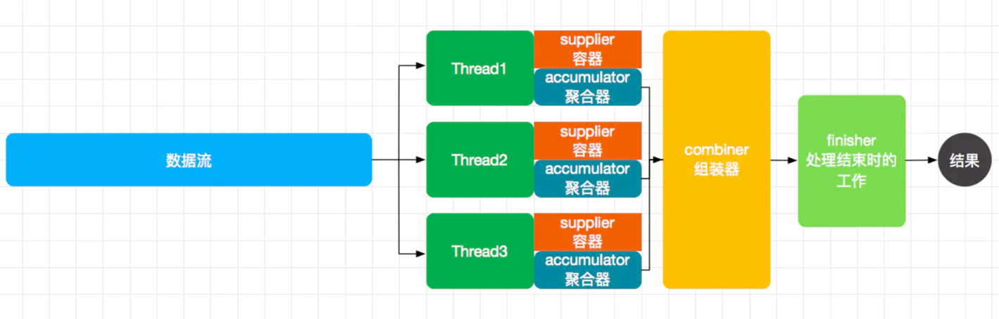
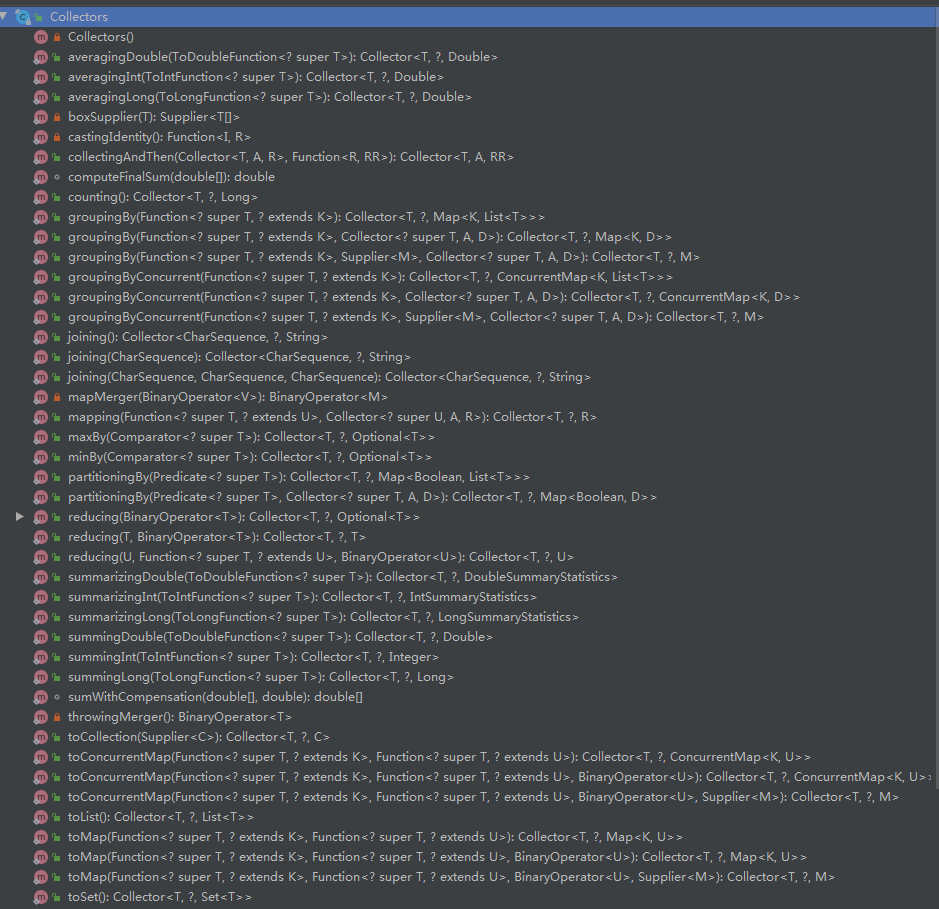

最近一段时间比较忙，也不知道都在做些什么。五一期间本来打算写一篇的，但是一直有各种事情拖着也没写下来。今天继续是计划内的一篇文章collector。

### 1、用来做什么的？

​	collectors直接翻译就是收集器。主要的作用是就是将流中的数据进行收集整理。collectors主要还是配合stream来使用。平常的话也不会用到。

### 2、都有哪些用法？

`	 Collectors`可以帮我们完成的事情，例如：分组、排序（支持多字段排序）、最大值、最小值、平均值，简单的来说，以前我们在数据上面用sql 去完成的聚合相关的操作，`Collectors` 都可以完成。可以参照stream那一篇。

### 3、源码怎么实现的？

  Collectors到底是怎么实现的呢？现在来看一下源码，一起学习一下。

先看一下collect需要传入的参数都有哪些。



可以看到有两种实现

一种实现就是传入三个函数。

```
    <R> R collect(Supplier<R> supplier,
                  BiConsumer<R, ? super T> accumulator,
                  BiConsumer<R, R> combiner);
```

另外一种实现就是传入一个collector。其实没有本质上的区别。

```
list.stream().collect(Collectors.toList())
```

先看看最简单的Collectors.toSet()实现。

```
    public static <T>
    Collector<T, ?, Set<T>> toSet() {
        return new CollectorImpl<>((Supplier<Set<T>>) HashSet::new, Set::add,
                                   (left, right) -> { left.addAll(right); return left; },
                                   CH_UNORDERED_ID);
    }
```

从上面代码可以看到toSet返回了一个CollectorImpl，CollectorImpl实现和上面的三个函数差不多。只有一个参数不一样。

```
   CollectorImpl(Supplier<A> supplier,
                      BiConsumer<A, T> accumulator,
                      BinaryOperator<A> combiner,
                      Set<Characteristics> characteristics) {
            this(supplier, accumulator, combiner, castingIdentity(), characteristics    }
```

下面开始理解这个三个函数到底都在做什么？

Supplier<A> supplier, supplier是主要创建一个新的对象返回。一般用来返回一个容器对象。

BiConsumer<A, T> accumulator, 主要是用来累加去喝，将新的T和A进行融合。一般来说T放入a的集合中

BinaryOperator<A> combiner,主要是用来对多线程的时候进行组装。

Set<Characteristics> characteristics 最后一个参数主要是描述集合的特性，需要做什么样的操作

具体流程是什么样的我们自己来实现一下

```
        List<String> list = Lists.newArrayList();
        list.add("香菜");
        list.add("聊游戏");
        Supplier<Set<String>> supplier = ()-> new HashSet<>();
        BiConsumer<Set<String>, String> accumulator = (set, s) ->  set.add(s);
        BiConsumer<Set<String>, Set<String>> combiner = (left,right)->{left.addAll(right);};
        Set<String> collect = list.stream().parallel().collect(supplier, accumulator, combiner);
        System.out.println(collect);
```

我们到底做了什么？

```
 	R result = supplier.get();
     for (T element : this stream)
         accumulator.accept(result, element);
     return result;
```

多线程的情况下就像下面这张图。



而collect中只有一个参数，那就是Collector对象，`java.util.stream.Collector`
 这是一个接口，其功能是将流处理的结果，汇聚处理成最终的一个可变对象（容器）。
 这个接口有5个方法：

1. `Supplier supplier();` 创建一个结果容器

2. `BiConsumer accumulator();` 将元素合并到结果容器中

3. `BinaryOperator combiner();` 将两个结果容器合并

4. `Function finisher();` 最终操作

5. `Set characteristics();`返回一个固定的特征集合

    特征集合：

    ```
            /**当前Collector支持并发，一般情况下UNORDERED也会一起放在characteristics中*/
            CONCURRENT,
    
            /** 当前Collector对操作元素是不会关心顺序的的 */
            UNORDERED,
    
            /**当前Collector没有Finisher*/
            IDENTITY_FINISH
    ```

    



看了源码应该了解是怎么回事了，具体的实现可以参照Collector 的实现，so easy

### 4、总结

`Collectors`一个常用的`collector`工厂，这个工厂就是`collect`中常用的收集方式的实现。记住最重要的那张图，一切就迎刃而解了。

PS：原创不易，关注我，可以领取游戏源码和编程资料。

每日一句

人生不像做饭，不能等万事俱备了才下锅。


