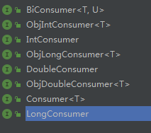

学会这招，再也不用写重复代码了，Consumer你指的拥有！

最近一直在忙功能的事情，基本上每天加班到至少十点半，好累，希望上线的功能一切安好。
在写代码的过程中，发现有很多重复的代码，idea 黄线提醒，但是有时又不想抽取方法，今天介绍一个方式，可以提高代码的整洁性和代码的稳定性。让你打开一片天空，瞬间将重复代码一降再降。

函数式接口的总介绍:[一篇文章掌握lambda,function下41个类](https://mp.weixin.qq.com/s?__biz=MzA4ODczMDIzNQ==&mid=2447775325&idx=2&sn=894a6c2d69152abb3e93e85196f11870&chksm=84370949b340805fdbc34c33a51e916053c6e7502851c0f301a13c94cd6dec2e728aa309bbd4&token=1318655681&lang=zh_CN#rd)

Consumer 是java 8 提供的函数式接口，看下源码。

andThen 方法时让Consumer可以链式处理的方法，不是今天的重点。

Consumer 是一个接收一个参数的一个函数，或者说一块代码块，这块代码块可以出现在任何地方。

下面介绍下应用场景：

1、Consumer 作为处理函数出现，再流程精细控制时使用。看代码吧

需求：我需要推送给大厅内所有玩家消息，但是消息的内容是不确定的，具体的逻辑实现放在外面。

创建这样一个函数，将玩家id传递给consumer，做具体的处理。

看看怎么调用的：

看懂了吗？推送的消息处理放在了里面，重复的逻辑不会再出现。开心。你学会了吗？

2、Consumer 作为代码块使用，简短的重复的代码，局部使用，定义，替换。看代码吧

同样的代码，只是传入的参数不同，但是这几行代码在其他地方又调用不到，所以没必要生成方法，此处用Consumer进行代码块提取，将原来重复的几行代码合并，减少代码行数，减少因为复制修改改错的风险，真是优美，你学会了吗？

还有其他的一些Consumer，用法是一样的，只是参数不同，举一反三即可。

总结：Consumer 是java 8 提供的函数式接口，**代表着一块代码块**，可以方便的解决重复代码的问题，还不赶快用起来吗？

提前祝大家中秋国庆快乐，不知道我什么时候才想起来写下篇文章。

