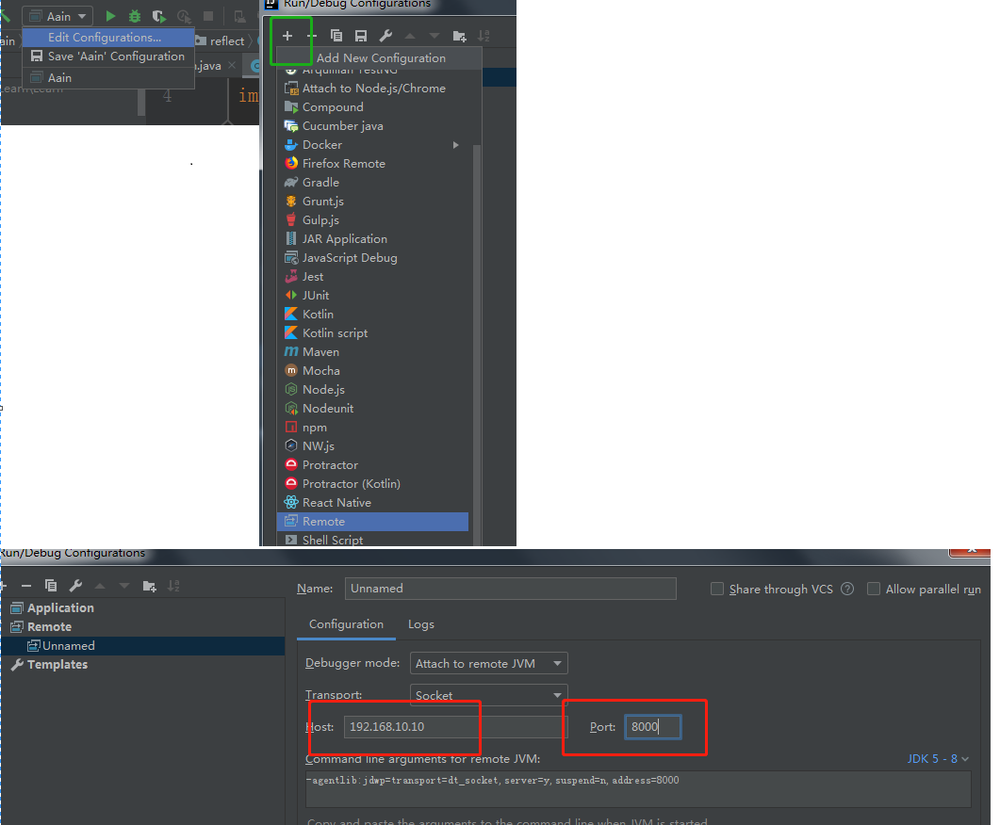

先学会这些调试技巧，再写代码，效率提高十倍。吐血整理！

**目录**

[1、断点分类](#1、断点分类)

[2、管理断点](#2、管理断点)

[3、条件断点](#3、条件断点)

[4、技巧](#4、技巧)

[5、远程调试](#5、远程调试)

作为程序大家都知道，写代码和调试的时间是差不多9：1，也就是说90% 的时间大家都在调试代码，怎么样才能最快的发现bug？


调试是开发中最重要的解决问题的方法，在开发中也看到很多同事只会简单的使用调试，因此写下这篇文章。正所谓 工欲善其事必先利其器，好的调试技巧让你在开发中如鱼得水。

调试从大的方面来讲主要是本地调试 和远程调试。本地调试就是在本地使用IDE的debug按钮启动项目，

远程调试一般是指调试其他机器上的程序。下面从这两个方面分开讲一下。因为我开发中使用的是idea，所以下面的实例和截图都来自idea。调试的技巧是一样的，用eclipse的同学可以自己迁移到eclipse上。

### 1、断点分类


1. 行断点

    顾名思义，行断点就是在代码的左边单击，红色的圆点就代表断点成功,在代码运行到这一行的时候会触发。

2. 方法断点

    方法断点就是断点在方法签名上，在调用这个方法时会触发断点。如上图菱形红点

3. field断点

    字段断点就是在字段的定义的地方加断点，任何访问或者写入的地方都会触发断点。

4. 异常断点
	
	 异常断点在debug视图下，点击两个小圆点，打开断点界面，然后点击“+”号，选择Java Exception Breakpoints，输入你想断点的异常名字。比如常用的NullPointerException，只要程序运行的时候抛出这个异常，都会触发断点。
	 

### 2、管理断点


1. 点击图中1位置，为取消所有断点，也就是所有的断点都不触发。
2. 点击图中2的位置，打开断点管理界面，勾选断点则代表断点起作用，不勾选则表示不起作用。


### 3、条件断点

​	条件断点太牛了，前面的断点每个写代码的应该都知道，是入门的。这部分是今天的重点，也是精华所在。如上图断点界面：

1. Enable 断点是否起作用，没什么可讲的，一般的时候会启用。

2. Suspend 挂起。后面有两个选项，选项All表示暂停当前应用的所有线程，Thread表示挂起当前正在运行代码的线程。一般在调试多线程的时候，选择thread，这样不会影响其他的线程，可以调试多线程问题。

3. Condition 懂点英文的都知道这个单词的意思，**条件**。
    
    这一部分的核心。当勾选了这个选项时，会运行Condition框内的代码，当为true时会触发断点。false的时候则不触发。条件输入的时候可以使用当前上下文的代码。如下图中，i== 1 就是条件，当i = 1时断点会触发。在调试的时候可以断点特定情况下的问题。也是最常用的功能。
    
    
4. Log 也很简单——日志，也就是断点时执行Evaluate and log 内的代码，在代码框内你可以调用日志系统或者直接控制台打印，避免修改代码打印输出，如果你只想打印，不想挂起线程，可以把Suspend取消，这样断点只会触发，不会将应用暂停。如果勾选stack trace 会打印调用堆栈，可以看到断点的触发来源。是不是很赞？
    

5. remove once hit 很简单，如果断点触发过一次，下次就会自动失效删除。

6. Disable until hitting the following breakpoint 这个选项的意思就是直到下面选中的的断点触发时才会触发激活当前断点，主要是为了调试顺序。 可以选中已经打的断点。

7. after hit 断点触发之后的操作，继续不可用，或者一直可用，看需求。

8. instance filter 勾选之后，只有输入的instanceId 运行到代码才会触发，用处不大。因为首先你要知道instance id。这个在运行时观察变量区@后面的id。
    

9. class filter 过滤类，只有特定的类才会断点。不常用。

10. pass count  运行多少次之后触发断点，一般用在循环内，特定次数之后触发断点。常用。避免查看不想看的循环代码。

11. caller filter 调用者过滤。只有某个方法调用的时候才会触发。针对一个方法被多个地方调用，但是只想断点个别的调用的时候。这个虽然看起来比较好用，但是比较坑的是需要输入方法的全签名，可以使用条件断点解决的尽量不使用这个。类似：org.pdool.reflect.Player.addString(Ljava/lang/String;)V，如下图:

     

### 4、技巧

1. ​	drop frame 回退堆栈。

    ​	在开发中，和客户端调协议的时候，有时候客户端操作了一下，断点到了，但是有些变量没注意到，这个时候可以保持断点，然后到Frames选中想要重看的函数，右键 drop frame。可以回退堆栈，重新运行一次函数。在使用的时候要注意，上一次已经修改了的全局变量，无法回滚。

    

2.alt + f8 运行时计算

​		在运行到一段断点代码的时候，想看一下其他变量的值，可以使用这个快捷键。当然也可以使用这个方式修改内存的值。比如 this.setName(" 香菜")，只要你输入的代码不报错都可以。


3.修改变量值

​	在调试的时候有些特殊条件不好出现，但是又想观察特殊条件下的程序行为，这个时候就可以通过修改变量，调整代码运行流程。


选择需要修改的变量，右键setValue 或者F2，输入需要修改的值，回车即可，这样对象的值就会被修改。这种修改是影响对象的整个生命周期的。

4.移动断点

​	选择断点，然后按住alt ,鼠标拖动断点，就可以移动断点的位置，整个断点的属性都会迁移。完美！

5.热更新

​	热更新就是在应用不重启的情况下将新改的代码应用。有以下限制：

1.函数参数格式不能修改。

2.不能为类添加函数。

3.不能为类添加变量。

4.只能修改函数内部的逻辑。

5.不能减少类的方法。

修改完代码之后，可以 ctrl + shift + F9，热更代码，在信息栏能看到更新成功，并且更新了几个类。

这个是在开发中很常用的功能，省去了一直重启的痛苦。


### 5、远程调试

当代码部署到测试服的时候，有些测试问题会爆出来，但是本地没有，或者因为数据环境，或者因为账号的特殊问题。这时候想要调试。远程调试出场的机会到了。

想要远程调试，第一步 首先必须在远程应用上打开调试端口，加入启动命令中，然后启动应用。

```
 -Xdebug -Xrunjdwp:transport=dt_socket,server=y,suspend=n,address=8000
```

第二步 在本机中，idea中，运行-->Edit Configurations --> +号 -->在下拉列表中选择Remote，然后输入远程机器的ip 和 启动的端口。

第三步 远程代码和本地代码连接成功之后，就可以和调试本地代码一样了。



你还知道哪些调试技巧，记得留言给我。