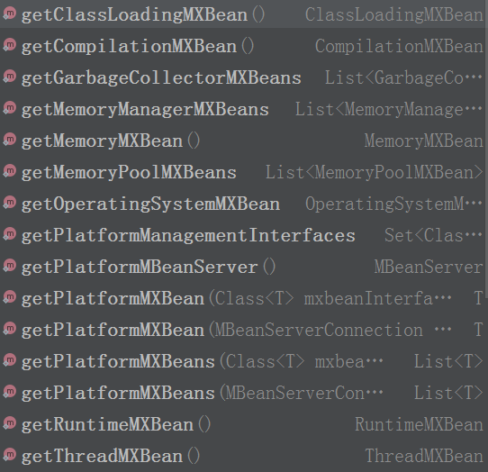
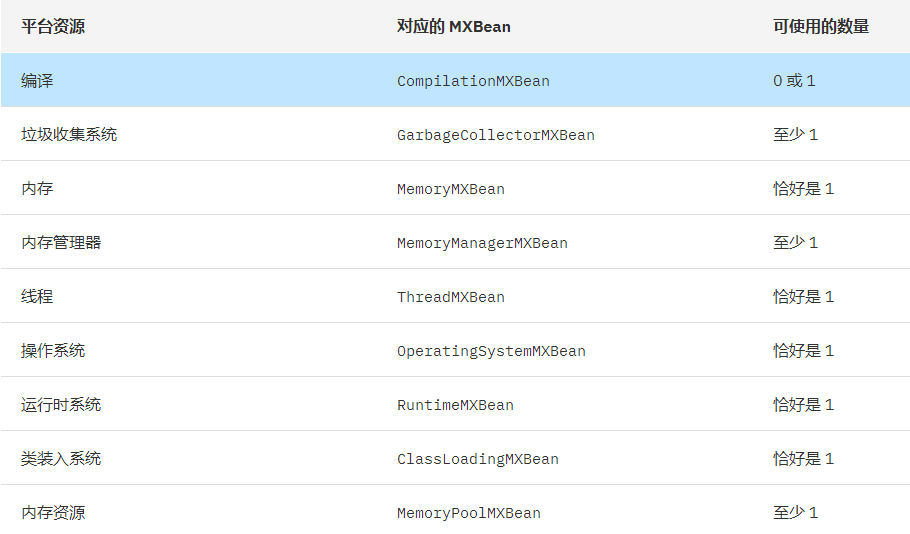
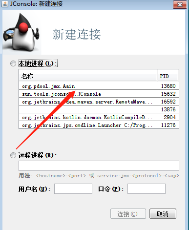
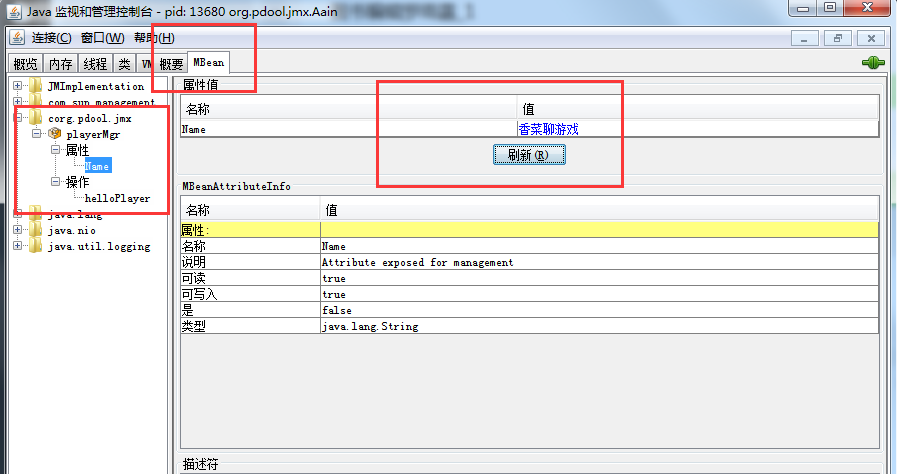
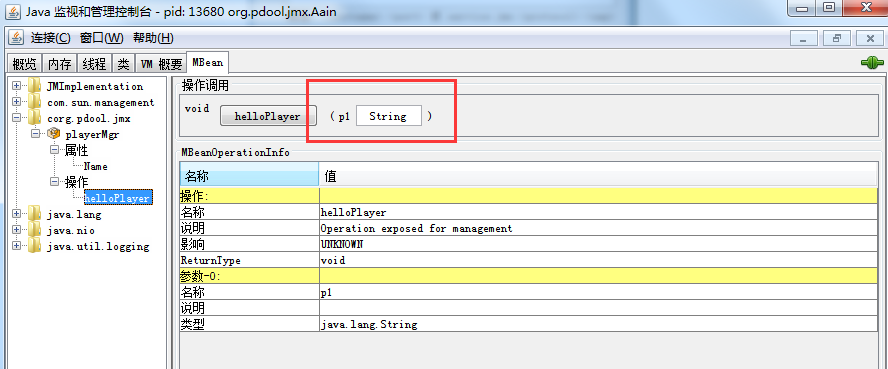
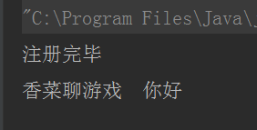

​		在开发中经常需要监控应用的运行情况，包括内存，cpu ,gc ,线程等信息，这些东西jdk提供的工具很多都有，如果我们自己想实现一些自己的管理，怎么样才能获得这些信息呐？今天一起来看一下这一切的起点——Jmx。

## 1、jmx是什么？

JMX —Java Management Extensions，翻译过来就是java 的管理扩展，是jvm 提供的一套监控的框架。为程序进行监控提供了统一的接口，让你不用写JNI，一样可以监控JVM内的资源使用情况。

### 2、官方提供了哪些？

mxbean 官方提供了一些常用的，如下面两张图，基本上看名字就能分辨出来，能提供jvm的哪些信息。



这么多都有什么用？




### 3、实现自己的标准mbean

​	上面这么多是怎么实现的呐？just show me the fuck code。

​	1.定义mbean 接口

```
/**
 * 香菜聊游戏
 */
public interface PlayerMgrMBean {
    public void setName(String newName);
    public String getName();
    public void helloPlayer(String worldStr);
}
```

​	2.实现接口

```
/**
 * 香菜聊游戏
 */
public class PlayerMgr implements PlayerMgrMBean {
    private String name ;
    @Override
    public String getName() {
        return name;
    }
    @Override
    public void setName(String newName) {
        this.name = newName;
    }
    @Override
    public void helloPlayer(String worldStr) {
        System.out.println(name + "  " + worldStr);
    }
}

```

​	3.注册mbean

```
    /**
 * 香菜聊游戏
 */
    public static void main(String[] args) throws Exception {
        MBeanServer mBeanServer = ManagementFactory.getPlatformMBeanServer();
        ObjectName name =  new ObjectName( "corg.pdool.jmx:type=playerMgr" );
        mBeanServer.registerMBean(new PlayerMgr(), name);
        System.out.println("注册完毕");
        Thread.sleep(24*60*60*1000);
    }
```

​	4.观测mbean。

​	打开 C:\Program Files\Java\jdk1.8.0_121\bin\jconsole.exe，选择你运行的app，然后双击打开，进行连接，读取数据。




根据自己注册的名字，打开自己注册的mbean，比如我代码中注册的名字是“corg.pdool.jmx”。



属性对应了 get/set 方法，下方展示了方法的属性和方法签名信息。



helloPlayer 对应了暴露的接口方法，p1 表示可以传入的参数是String，可直接修改，如果传入“香菜聊游戏”，然后点击helloPlayer 按钮，后台就会输出打印信息。



### 4、应用场景

技术的存在必然是有应用的场景,使用jmx的有哪些有名的应用呐？比如arthas,中间件软件WebLogic的管理页面就是基于JMX开发的，而JBoss则整个系统都基于JMX构架。

### 5、总结

​	mbean 说白了就是应用内启动了MBeanServer，用户根据自己的需求注册，然后在运行时进行客户端连接，获取信息，标准的CS结构，只不过规则不同而已，遵守接口规则，并没有什么特别的东西，节省了定制 JNI 的时间，仅此而已。系统提供的这些已经可以实现了大部分的监控需求，如果你想定制，只要记得接口规则，至于内容就自由发挥吧。你学会了吗？

写点字不容易，点个赞，关注下，转发 素质三连。谢谢支持


### 六、Notification

 MBean之间的通信是必不可少的，Notification就起到了在MBean之间沟通桥梁的作用。JMX 的通知由四部分组成：

1、Notification这个相当于一个信息包，封装了需要传递的信息

2、Notification broadcaster这个相当于一个广播器，把消息广播出。

3、Notification listener 这是一个监听器，用于监听广播出来的通知信息。

4、Notification filiter 这个一个过滤器，过滤掉不需要的通知。这个一般很少使用。

这里我们使用日常打招呼的场景：jack与我偶遇，jack说：hi；我礼貌的回答：hello，jack

