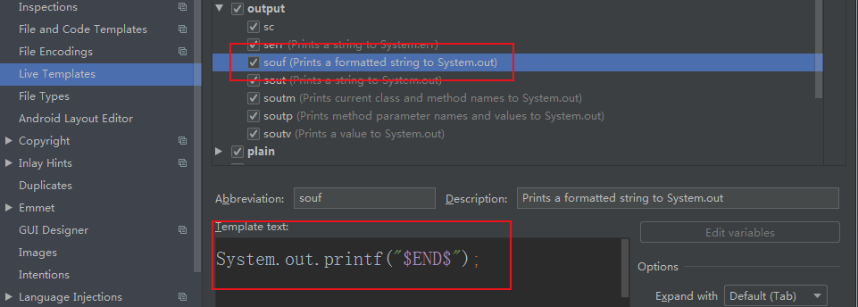
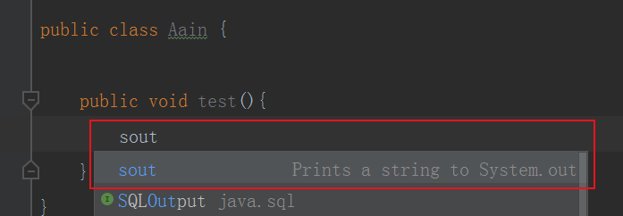
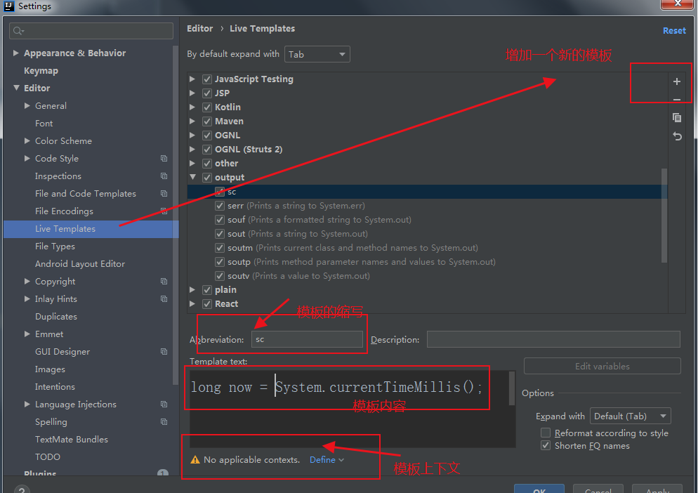
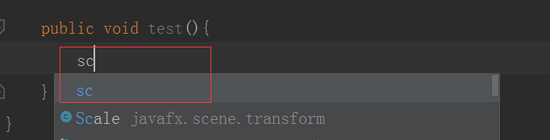

首先祝大家国庆快乐，中秋快乐，谢谢各位的关注，CSDN粉丝当前是1300，谢谢各位大佬的厚爱，继续坚持。

每天都在写代码，总有些是重复的工作，IDE帮我们做了很多，但是工作中一些项目的固定套路IDE是没办法帮我们做的，有没有什么办法减少这些重复性的工作，节省一点时间去划水摸鱼？问题存在就会有解决办法，今天先分享下一个小技巧，大杀器下期。

## 1、利用idea的live template 

### 	1.创建代码模板，毕竟是最好用也是最牛逼的java编辑器。

​		在File -> Settings -> Editor -> Live Templates下可以设置Live Templates，如下

### 2.观察原有模板

这个是我们常用的输出函数，只需要做如下输出，就会提示代码，按下回车就是你想要的，完美，轻松。

如果你够细心的话，一定看到了 $END$  ，这是系统的内置变量，表示光标的所在位置，这样的话会方便你输入。是不是很贴心。

- $END$，表示最后都编辑完后光标所处的位置
- $SELECTION$，表示设置环绕实时代码模板 也就是你选中代码后的一些列操作，比如 try catch ,不相信的话你试试呐。

怎么查看有哪些内置变量呐？idea ->help ->idea ->template-variables 也就是下面的网址：    https://www.jetbrains.com/help/idea/template-variables.html ，本想截个图，不知道为什么打不开网页。难受，香菇。

### 	3.设置，创建一个自己的模板

 	 首先选中一个组别或者创建一个自己的组别，我会创建一个自己的组别，根据自己的语言和语境选择吧。follow your heart！

情景：在开发中我们的数据库需要保存数据的更新时间，因此我常用的一个变量就是当前时间，获取当前时间的代码也挺长的，所以我在这地方创建一个输出当前时间的语句。步骤如下：创建一个模板，然后输入模板的关键字，输入关键字所代表语句，最后选择一下上下文，也就是你在什么地方输入的时候才会提示。举个例子，你在maven文件的上下文是不可能出现这一句的，所以你怎么打sc 都不会提示。所以我的上下文选择Java。

​	

​	

### 	3.如何使用

 在你设置的上下文输入中填入模板的缩写，编辑器会自动匹配提示，选中你的模板，然后回车，就会自动填充你预先设置的代码模板，简直完美。

如果你连缩写也不想输入，直接 按下快捷键  Ctrl + J 会提示当前上下文可以使用的模板，选择你想要的模板，也可以，懒人的办法可真多。

## 总结：我很懒，不想写代码

不得不说 idea 真的很强大，强烈推荐各位用eclipse的同学去体验这份快乐。live template 的用的好，代码又快又好，没有bug，节省的时间用来摸鱼划水不香吗？快在你同事面前秀出你的操作，让他在风中一脸懵逼的崇拜你吧。今天就到这里了，下篇将会写一下大杀器，具体是什么呐？

打字不容易，点赞，转发，关注三连，谢谢大家，对了，关注我公众号：【香菜聊游戏】有更多福利哦。常规福利双手送上。