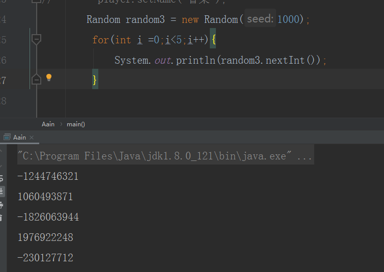
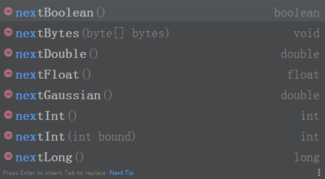

### 1、随机数怎么用？

在游戏开发中，有个需求就是在客户端的战斗行为需要在其他的客户端上进行同步播放，但是战斗中一些随机的技能，伤害等没办法同步，遇到这样的问题怎么办？是时候展现随机数的魅力。在开始战斗的时候从服务器获取一个随机种子，然后在不同的客户端用同一个种子进行随机，得到的随机数也会保持一致，完美的完成了策划的需求。

伪代码如下：




> 百度百科：伪随机数是用确定性的算法计算出来自[0,1]均匀分布的随机数序列。并不真正的随机，但具有类似于随机数的统计特征，如均匀性、独立性等。在计算伪随机数时，若使用的初值（种子）不变，那么伪随机数的数序也不变。伪随机数可以用计算机大量生成，在模拟研究中为了提高模拟效率，一般采用伪随机数代替真正的随机数。模拟中使用的一般是循环周期极长并能通过随机数检验的伪随机数，以保证计算结果的随机性。 

说白了就是如果你给我种子，不管你在什么时候，什么情况，我保证你最终得到的值都是一致的。

### 2、random 怎么生成？

```java
        double r1 = Math.random();
        Random random2 = new Random();
        int r2 = random2.nextInt();
        Random random3 = new Random(1000);
        int r3 = random3.nextInt();
```

Random类专门用于生成一个伪随机数，它有两个构造器：

一个构造器使用默认的种子（以当前时间作为种子），

另一个构造器需要程序员显示传入一个long型整数的种子。

Random类比Math类的random()方法提供了更多的方式来生成各种伪随机数，可以生成浮点类型的伪随机数，也可以生成整数类型的伪随机数，还可以指定生成随机数的范围。

Random类的常用用法如下示例：




### 3、random原理

哪有什么原理，不过是规则而已，只是这规则不是你定的？我们看看别人怎么做的。

需要解决的问题？

1、两种构造函数的区别？

2、伪随机是怎么做的？

3、为什么给一个随机种子就能一直保证生成的随机数不变？

4、有什么不知道的用法？

1、看下构造函数有什么区别：

```
    public Random() {
        this(seedUniquifier() ^ System.nanoTime());
    }
    
```

```
        public Random(long seed) {
        if (getClass() == Random.class)
            this.seed = new AtomicLong(initialScramble(seed));
        else {
            // subclass might have overriden setSeed
            this.seed = new AtomicLong();
            setSeed(seed);
        }
    }
```

可以看到有参的构造函数和无参的构造函数区别，就是无参的调用有参的，我们也常这么做，简单，没啥。

2、伪随机是怎么做的？挑一个简单的看下 ，nextInt 如下：

```
    public int nextInt() {
        return next(32);
    }
```
继续跟进，发现敌军大本营。
```
    protected int next(int bits) {
        long oldseed, nextseed;
        AtomicLong seed = this.seed;
        do {
            oldseed = seed.get();
            nextseed = (oldseed * multiplier + addend) & mask;
        } while (!seed.compareAndSet(oldseed, nextseed));
        return (int)(nextseed >>> (48 - bits));
    }
```

可以看到上面的代码很简单，就是取出一个种子，然后一系列瞎几把操作，生成一个新的种子并赋值给种子，最后通过一波我们不太熟练的移位操作，向右移了 48 - bits ，bits 是32 写死的。

所以伪随机是怎么做的呐？就是先使用一个函数进行变换，然后进行移位，因为这些操作都是固定的，所以保证了伪随机数的顺序固定值。

3、为什么给一个随机种子就能一直保证生成的随机数不变？

上面的代码已经很明显了。

```
nextseed = (oldseed * multiplier + addend) & mask
```
看下multiplier ，addend ，mask 的定义
```
    private static final long multiplier = 0x5DEECE66DL;
    private static final long addend = 0xBL;
    private static final long mask = (1L << 48) - 1;
```
都是常量，当然保证了结果也是固定的。如果不信的话可以代入几个进行计算下。

4、有什么不常用的用法？

4.1 高斯分布、正态分布

```
random3.nextGaussian()
```

方法用于获取下一个伪高斯(“正常地”)分布的均值为0.0，标准差为1.0从此随机数生成器的序列的double值。

4.2 Random 它是一个线程安全类，这样的线程安全是通过AtomicLong实现的。

Random 使用 AtomicLong 操作来更新它的seed，在多线程操作时性能相对来说较差，因此出现了一个类。

```
ThreadLocalRandom
```

不怎么常用的一个类，是对random增强的用法，看名字也猜得到，线程安全。

4.3 流。

```
IntStream ints()`
`创建一个无穷大的伪随机int值流。
```

### 4、总结

random 生成随机数，虽然常用但是没有细看源码的一个类，全部掌握了吗？


PS：原创不易，关注我公众号：香菜聊游戏，不粘人还可以领取编程资料和游戏源码。