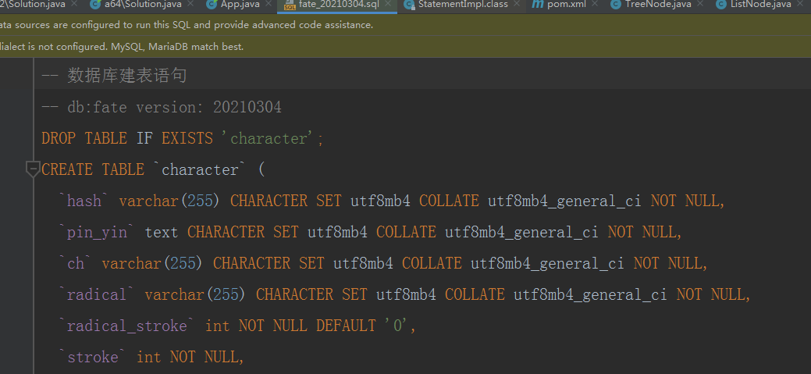

今天有空整了下之前写的数据库备份的代码。

## 1、工作中的问题

数据库开发流程一般是先在power design 中新建表结构（因为pd其他部门要看的），然后拷贝生成的DDL建表语句，在数据库中执行，然后才算创建了一张表。这样的工作流程中间有一些问题。

### 	1、不方便修改，打断了代码开发的专注。

如果在开发的过程中想要修改表，我会直接在数据库中通过Navicat修改表结构，进行增删改，正常的情况下然后还要同步到pd中。这样的流程打断了我开发代码的专注度，因此需要将我们从这样的繁琐事总解脱出来。

### 	2、容易遗忘，会有心理负担

修改数据是基本操作，如果在开发功能的过程中频繁修改，去同步pd，会给开发产生负担，这样的情况下就会产生遗忘，在功能开发完成的情况下，基本上很少去再次补全pd,一份不完整的pd意义是不大的。毕竟不想每次都有人问表的结构怎么样，也不想费口舌，也会有自己没有维护好，没有做好的感觉。

### 	3、游戏版本更新频繁，无法回滚数据库

在最忙的时候，游戏基本上是两周一个新版本，每个版本都会伴随一些表的变更，虽然我们的游戏代码都会有版本记录，但是数据的表结构一直没有号的备份，这样的情况下造成数据库表结构很难回滚，所以需要想办法对数据库进行备份。

## 2、解决方案

有这样的问题，必然想要解决。解决问题了才能提升工作效率（有时间划水），减少犯错的可能性（不想背锅）。下面是我写的整理数据的工具，使用了screw，我新增了对数据库表结构的备份，下载代码，简单改下配置就可以直接运行，拿去不谢。

优化点：

1、对生成的文件加了日期作为版本号

2、在表结构中新加了删除表的语句

3、

```
package screw;

import cn.smallbun.screw.core.Configuration;
import cn.smallbun.screw.core.engine.EngineConfig;
import cn.smallbun.screw.core.engine.EngineFileType;
import cn.smallbun.screw.core.engine.EngineTemplateType;
import cn.smallbun.screw.core.execute.DocumentationExecute;
import cn.smallbun.screw.core.process.ProcessConfig;
import com.zaxxer.hikari.HikariConfig;
import com.zaxxer.hikari.HikariDataSource;

import javax.sql.DataSource;
import java.io.File;
import java.io.FileOutputStream;
import java.io.IOException;
import java.io.OutputStreamWriter;
import java.nio.charset.StandardCharsets;
import java.sql.PreparedStatement;
import java.sql.ResultSet;
import java.sql.SQLException;
import java.sql.Statement;
import java.text.SimpleDateFormat;
import java.util.ArrayList;
import java.util.Date;
import java.util.List;

public class App {


    public static void main(String[] ags) throws IOException, SQLException {

        String dbName = "fate";
        HikariConfig config = new HikariConfig();
        config.setDriverClassName("com.mysql.cj.jdbc.Driver");
        config.setJdbcUrl("jdbc:mysql://127.0.0.1:3306/" + dbName +" ?serverTimezone=UTC");
        config.setUsername("root");
        config.setPassword("root");
        config.addDataSourceProperty("useInformationSchema", "true");
        config.setMinimumIdle(2);
        config.setMaximumPoolSize(5);
        DataSource ds = new HikariDataSource(config);
        String userDir = System.getProperty("user.dir") + "//src//test//java//com//pdool//";
        System.out.println(userDir);
        SimpleDateFormat dataFormat = new SimpleDateFormat("yyMMdd");
        String versionStr = dataFormat.format(new Date());
        List<String> ignoreTable = new ArrayList<>();
        List<String> ignorePrefix = new ArrayList<>();
        List<String> ignoreSuffix = new ArrayList<>();
        ignoreSuffix.add("_test");
        ignoreSuffix.add("test");

        for (int i = 0; i < 10; i++) {
            ignoreSuffix.add(String.valueOf(i));
        }
        createHtml(ds, userDir, versionStr, ignoreTable, ignorePrefix, ignoreSuffix);
        createSql(dbName, ds, userDir, versionStr, ignoreTable, ignorePrefix, ignoreSuffix);
    }

    public static void createHtml(DataSource dataSource, String userDir, String versionStr, List<String> ignoreTable, List<String> ignorePrefix, List<String> ignoreSuffix) {

        EngineConfig engineConfig = EngineConfig.builder()
                .fileOutputDir(userDir)
                .openOutputDir(false)
                .fileType(EngineFileType.HTML)
                .produceType(EngineTemplateType.freemarker)
                .build();

        ProcessConfig processConfig = ProcessConfig.builder()
                .ignoreTableName(ignoreTable)
                .ignoreTablePrefix(ignorePrefix)
                .ignoreTableSuffix(ignoreSuffix)
                .build();

        Configuration config = Configuration.builder()
                .version(versionStr)
                .description("数据库文档")
                .dataSource(dataSource)
                .engineConfig(engineConfig)
                .produceConfig(processConfig).build();

        new DocumentationExecute(config).execute();
    }

    public static void createSql(String dbName, DataSource dataSource, String userDir, String versionStr, List<String> ignoreTable, List<String> ignorePrefix, List<String> ignoreSuffix) throws IOException, SQLException {
        Statement tmt = null;
        PreparedStatement pstmt = null;
        List<String> createSqlList = new ArrayList<>();
        String sql = "select TABLE_NAME from INFORMATION_SCHEMA.TABLES where TABLE_SCHEMA = '"+dbName+"' and TABLE_TYPE = 'BASE TABLE'";
        tmt = dataSource.getConnection().createStatement();
        pstmt = dataSource.getConnection().prepareStatement(sql);
        ResultSet res = tmt.executeQuery(sql);
        while (res.next()) {
            String tableName = res.getString(1);
            if (tableName.contains("`")) {
                continue;
            }
            if (ignoreTable.contains(tableName)) {
                continue;
            }
            boolean isContinue = false;
            for (String prefix : ignorePrefix) {

                if (tableName.startsWith(prefix)) {
                    isContinue = true;
                    break;
                }
            }
            if (isContinue) {
                continue;
            }
            for (String suffix : ignoreSuffix) {
                if (tableName.startsWith(suffix)) {
                    isContinue = true;
                    break;
                }
            }
            if (isContinue) {
                continue;
            }
            ResultSet rs = pstmt.executeQuery("show create Table `" + tableName + "`");

            while (rs.next()) {
                createSqlList.add("DROP TABLE IF EXISTS '" + tableName + "'");
                createSqlList.add(rs.getString(2));
            }
        }

        String head = "-- 数据库建表语句 /r/n";
        head += "-- db:" + dbName + " version: " + versionStr + "/r/n";
        String collect = String.join(";/r/n", createSqlList);
        collect = head + collect + ";";
        string2file(collect, userDir + dbName + "_" + versionStr + ".sql");
    }

    public static void string2file(String collect, String dirStr) throws IOException {
        System.out.println("文件地址  "+ dirStr);
        OutputStreamWriter osw = null;
        try {
            osw = new OutputStreamWriter(new FileOutputStream(new File(dirStr)), StandardCharsets.UTF_8);
            osw.write(collect);
            osw.flush();
        } finally {
            if (osw != null) {
                osw.close();
            }
        }
    }


}
```


## 3、运行的结果

生成的文件如下图

文件地址：控制台也有打印文件地址

文件说明：fate_20210304.sql ：数据库名 fate ,生成日期是20210304,内容是建表语句。主要用来和代码对应，恢复数据库。

fate_数据库文档__20210304.html:：数据库名 fate ,生成日期是20210304，内容是html，主要用来给其他部门交流。





## 总结

本来在公司已经写好的工具，可惜公司内网没办法拿出来，自己又重写了一遍，也花费了不少时间，挺晚了，准备睡觉。

PS：原创不易，关注我公众号：香菜聊游戏，不粘人还可以领取编程资料和游戏源码。

常规福利双手送上。