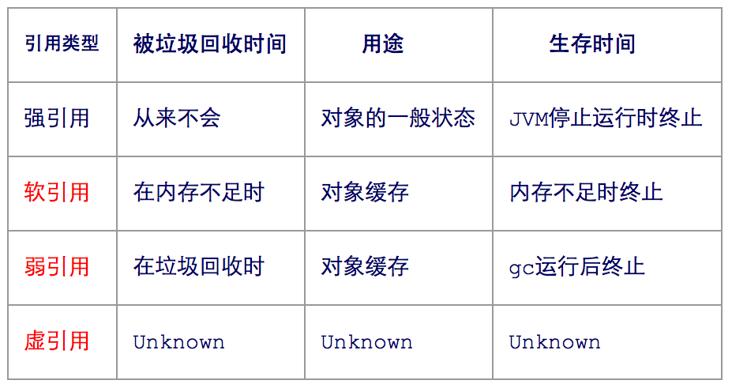

​	

​	坚持真TM是一件很难的事。今天聊聊Java的引用，大多数时候我们说引用都是强引用，只有在对象不使用的情况下才会释放内存，其实Java 内存在四种不同的引用。一起看看吧。

### 1、引用的定义

在JDK 1.2以前，Java中的引用定义很传统：如果reference类型的数据存储的数值代表的是另外一块内存的起始地址，就称这块内存代表着一个引用。

###   2、问题

​	当描述这样的一类对象：当内存空间还足够时，则能保留在内存之中，如果内存空间在进行垃圾收集后还是非常紧张，则可以抛弃这些对象。此时的引用就显得过于狭隘。因此在JDK 1.2之后，Java堆引用的概念进行了扩充。

### 3、引用的分类

|        |                   |                                                              | 回收时机                                                     |
| ------ | ----------------- | ------------------------------------------------------------ | ------------------------------------------------------------ |
| 强引用 | Strong Reference  | 类似Object obj = new Object()                                | 只要强引用还存在，垃圾收集器永远不会回收掉被引用的对象       |
| 软引用 | Soft Reference    | 描述一些还有用但并非必须的对象                               | 在系统将要发生内存溢出的异常之前，将会把这些对象列进回收范围之中进行第二次回收。如果这次回收还没有足够的内存，才会抛出内存溢出异常 |
| 弱引用 | Weak Reference    | 用来描述非必须对象，强度比软引用更弱。被弱引用关联的对象只能生存到下一次垃圾收集发生之前 | 当垃圾收集器工作时，无论当前内存是否足够，都会回收掉纸杯弱引用关联的对象 |
| 虚引用 | Phantom Reference | 又称为幽灵引用或幻影引用，最弱的一种引用关系。一个对象是否有虚引用的存在，完全不会对其生存时间构成影响，也无法通过虚引用来取得一个对象实例。 | 为一个对象设置虚引用关联的卫衣目的就是能在这个对象被收集器回收时收到一个系统通知 |

### 4、应用场景

1.强引用

​	最常用的，应用场景最多，everywhere

2.软引用

​	只有将要发生OOM的时候，才会主动回收，应用在一些内存限制比较大的应用内，避免发生OOM。

3.弱引用

​	不管是young gc  还是 full gc 都会回收弱引用的对象。当你想引用一个对象，但是这个对象有自己的生命周期，你不想介入这个对象的生命周期，这时候你就是用弱引用。

4.虚引用

​	在回收时可以检测到，虚引用主要用来跟踪对象被垃圾回收器回收的活动。



### 5、源码

```Java
package org.pdool.ref;

import java.lang.ref.Reference;
import java.lang.ref.ReferenceQueue;
import java.lang.ref.WeakReference;
import java.util.LinkedList;

public class ReferenceTest {

    private static ReferenceQueue<VeryBig> rq = new ReferenceQueue<VeryBig>();

    public static void checkQueue() {
        Reference<? extends VeryBig> ref = null;
        while ((ref = rq.poll()) != null) {
            //   只留有引用，没有对象
            System.out.println("In queue: "    + ((VeryBigWeakReference) (ref)).id);
        }
    }

    public static void main(String args[]) {
        int size = 3;
        LinkedList<WeakReference<VeryBig>> weakList = new LinkedList<WeakReference<VeryBig>>();
        for (int i = 0; i < size; i++) {
            weakList.add(new VeryBigWeakReference(new VeryBig("Weak " + i), rq));
            System.out.println("Just created weak: " + weakList.getLast());
        }

        System.gc();
        try {
            // 暂停6s，让上面的垃圾回收线程运行完成
            Thread.currentThread().sleep(6000);
        } catch (InterruptedException e) {
            e.printStackTrace();
        }
        checkQueue();
    }
}

class VeryBig {
    public String id;
    // 占用空间,让线程进行回收
    byte[] b = new byte[2 * 1024];

    public VeryBig(String id) {
        this.id = id;
    }

    protected void finalize() {
        System.out.println("Finalizing VeryBig " + id);
    }
}

class VeryBigWeakReference extends WeakReference<VeryBig> {
    public String id;

    public VeryBigWeakReference(VeryBig big, ReferenceQueue<VeryBig> rq) {
        super(big, rq);
        this.id = big.id;
    }

    protected void finalize() {
        System.out.println("Finalizing VeryBigWeakReference " + id);
    }
}
```

### 6、总结

​	虽然Java提供了这么多引用，但是在平常的业务开发中基本上只要强引用就可以了，整体来说上面除了强引用其他三个引用都是和内存相关的，只要在开发中不要内存泄漏，基本上内存不会出现问题，祝各位好运。求关注点赞。