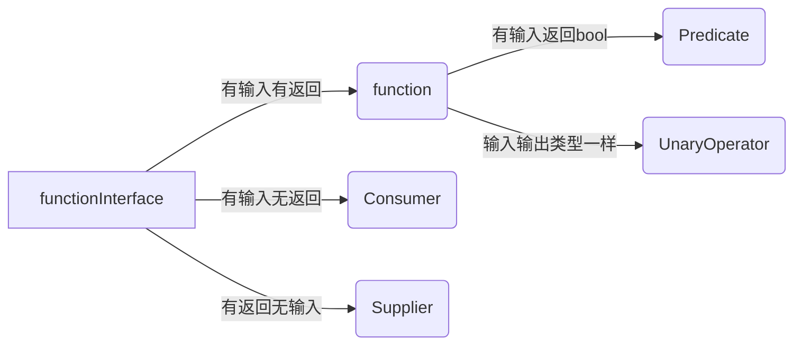
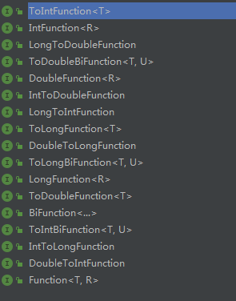
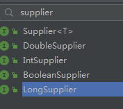

16 +24 + 1

Java8 发布以来，lambda 表达式简化了代码，增强了阅读性，代码更加简洁。lambda 主要是给Java增加了函数式编程的方式。lambda表达式的实现就是functionInterface。

函数编程的最直接的表现在于将函数作为数据自由传递，结合泛型推导能力使代码表达能力获得飞一般的提升。同时Lambda表达式让你能够将函数作为方法参数或者将代码作为数据对待，让你发现“行级代码”优美。

lambda 的语法是 ：

```
(输入)->{输出}
```

只有一行代码时，可以不加括号，可以不写return。

```java
 IntSupplier func = ()-> 1;
```

Java中的first class 是class ,所以底层来说是不支持函数式编程的，因为函数式编程语言的first class 是函数。为了增加函数式编程的思想，所以有了functionInterface这种解决方式。

英文翻译
| 单词  | 中文    |
| --------- | ---------- |
| consumer  | 消费者     |
| supplier  | 生产者     |
| function  | 函数       |
| predicate | 判断，预测 |
| Binary    | 两个       |
| unary     | 单个       |


- ## 1.行为分类

- ## 2.实现分类

    1.function 

    ​	

    命名方式: 输入类型To输出类型Function

    2.Consumer

    

    命名方式：输入类型Consumer

    3.supplier

    

    命名方式：输出类型Supplier

- ## 3.用法

    ```java
    package org.pdool.reflect;
    
    import lombok.AllArgsConstructor;
    import lombok.Getter;
    import lombok.Setter;
    
    /**
     * 玩家类 公众号：香菜聊游戏
     */
    @AllArgsConstructor
    public class Player {
        //  名字
        @Getter @Setter
        public String name;
        //  性别
        @Getter @Setter
        private int sex;
        //  年龄
        @Getter @Setter
        private int age;
        //  工资
        @Getter @Setter
        private int salary;
    
    }
    ```

    在同步代码块的时候经常会到处添加synchronized，为了保证所有的代码都在player的同步下做，可以使用function，减少代码重复。

    ```java
        public Object doSynOnPlayer(Function<Player,Object> function){
            synchronized (player){
                return function.apply(this.player);
            }
        }
    ```

    

    

- ## 4.自己实现

    

```java
package org.pdool.reflect;

/**
 * 公众号:香菜聊游戏
 */
@FunctionalInterface
interface PlayerService {
    void apply(Player player);
}

public static void main(String[] args) throws Exception {
        Player player = new Player("香菜聊游戏", 1, 18, 3000);
        PlayerService func = (player1)-> System.out.println(player1.getSex());
        func.apply(player);

    }

```

## 5.总结

上面这么多实现并不重要，只要记住函数式可以传递的，function<T,R>，一个入参，一个返回值。掌握了之后就会发现有些并不需要自己实现，有现成的何乐而不为。

。函数式编程的lambda现在很多语言都已经支持，java也有很好的api支持，可以试着接受这种方式，不用一下怎么才能发现不合适，说不定你能发现他的好。