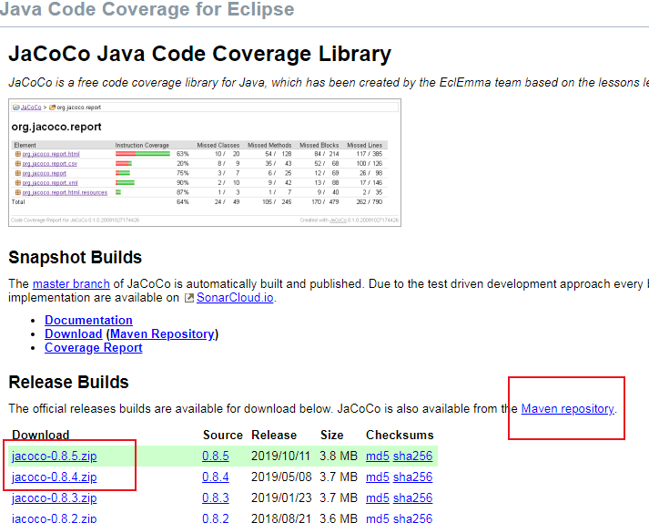
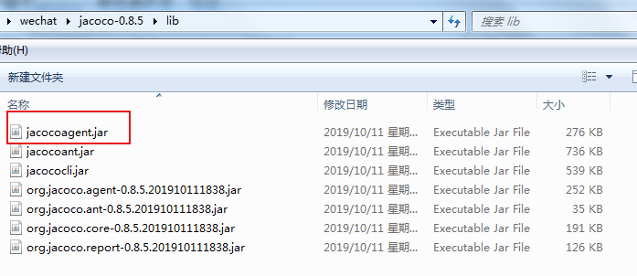
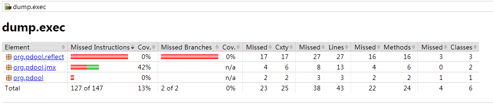
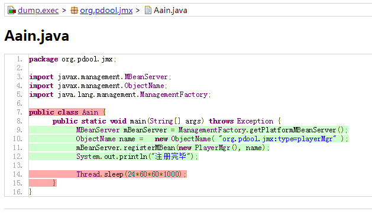
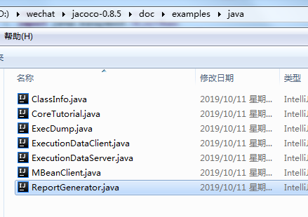
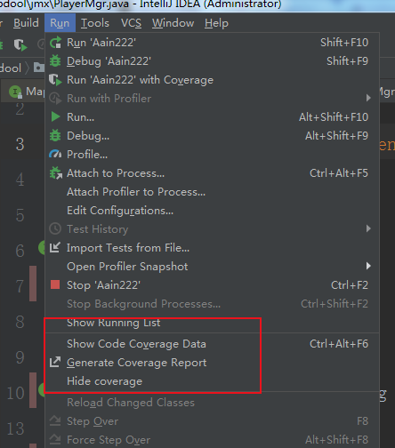
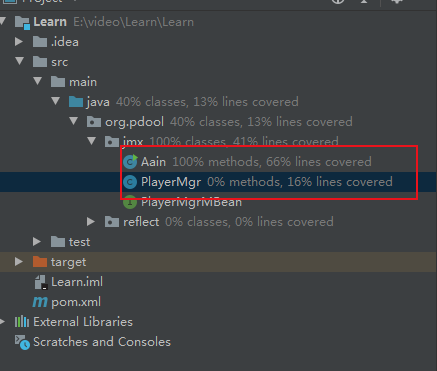
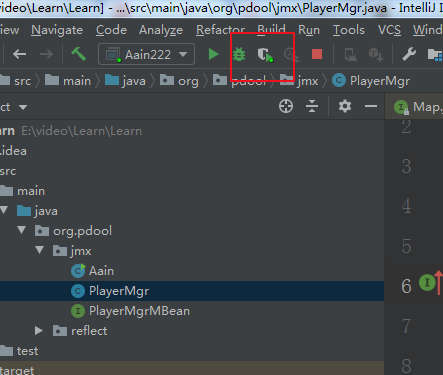

距离上篇文章挺久的了，天天的也不知道在干嘛，时间就溜过去了。今天聊聊前段时间整理的jacoco。Jacoco是一个针对java语言开源的代码覆盖率工具。

## 1、为什么会有jacoco？

​	Jacoco是代码覆盖率工具，工具解决的问题就是代码覆盖率问题，为什么要查看代码的覆盖率?

或者说有了代码覆盖率能做什么？主要有以下几个方面：

1. 可以查看代码的分支执行情况，可以查看代码是否存在因为bug 而产生分支不执行的问题
2. 可以查看垃圾代码，清理无用代码。
3. 提升代码质量，覆盖率的代码基本上质量不会好，可能因为设计的原因，造成代码过于松散，可以看下是否有重构的必要性。

## 2、jacoco配置

市面上 Java常用覆盖率工具的工具有Jacoco、Emma和Cobertura。

今天专门聊下jacoco。感觉像奶茶。哈哈，注意下面这是今天的正题哦。

- ​	2.1 jacoco 下载。

    有两种方式：直接下载jar包或者通过maven仓库。

    通过下面的官方网址： https://www.jacoco.org/jacoco/

    

    下载解压后：

    

- 2.2 jacoco配置

    jacoco可以有两种生效模式：**On-The-Fly代理模式**  和 **Offine模式**

    这里只说fly模式，这种模式是基于javaagent，使用方便简单。在启动脚本中加入如下代码:

    ```
    -javaagent:D:\wechat\jacoco-0.8.5\lib\jacocoagent.jar=output=tcpserver,address=*,port=8888
    ```

    然后启动应用就可以进行代码覆盖率统计，这种模式是CS结构，应用是server，监听在8888 端口。

- 2.3 jacoco的导出。

    既然生成了数据，就要导出，怎么导出呐？先切换到lib目录，然后使用下面的命令：

    ```
    java -jar jacococli.jar dump --address 127.0.0.1 --port 8888 --destfile /dump.exec
    ```
    

这样将导出生成exec的统计文件。
- 2.4 生成我们看的懂的数据——html或者csv。

    因为exec文件我们没办法直接查看，因此需要生成report。report的命令我就不演示了，因为不重要，等下我会介绍一个效率更高的方式。命令如下

    ```
    java -jar jacococli.jar report [<execfiles> ...] --classfiles <path> [--csv <file>] [--encoding <charset>] [--help] [--html <dir>] [--name <name>] [--quiet] [--sourcefiles <path>] [--tabwith <n>] [--xml <file>]
    ```
生成的html格式的报告如下：
    

    点开可以看具体的代码执行：

    

- 2.5 覆盖率分析

    进入源代码，就可以看见自动化测试的行覆盖率：
    
    - 红色：无覆盖，没有分支被执行
    - 黄色：部分覆盖，部分分支被执行。
    - 绿色：全覆盖，所有分支被执行。

## 3、ide中的配置

- 3.1 dump 和 report的官方代码。

    在内网环境的覆盖率统计，因为经常会拉下来看一下，总是使用命令这种方式比较低下。

    官方提供了代码实现 。

    

    ExecDump.java 对应 dump命令，生成exec文件。

    ReportGenerator.java 对应 report命令，生成html。

- 3.2 生成的exec文件使用idea 进行解析。



 show code coverage data  显示覆盖率数据，这个命令可以解析exec文件，并且将解析的覆盖率数据显示在项目的代码上。如果不想显示可以使用hide coverage，隐藏覆盖率数据。

 generate coverage data 导出数据到html。

## 4、使用步骤

到这一步讲完了基本的使用步骤。下面讲一下在工作中的使用步骤。		

Jacoco的使用分为三部分，

​				第一部分是注入并采集。使用javaagent启动。

​				第二部分是导出。使用批处理命令或者使用官方提供的代码ExecDump.java 导出exec到本地。

​				第三部分是生成报告，可以用批处理命令或者使用官方的代码ReportGenerator.java，或者使用idea 内置的工具。

如果只是在本地进行代码覆盖率统计，直接可以使用IDE的统计。

 

截取了idea 应用启动的时候的参数，可以看出idea同样是注入agent进行采集。

```
"C:\Program Files\Java\jdk1.8.0_121\bin\java.exe" -javaagent:C:\Users\Administrator\.IntelliJIdea2019.3\system\testAgent\intellij-coverage-agent-1.0.508.jar=C:\Users\Administrator\AppData\Local\Temp\coverage2args 
```

停止应用的时候，idea会自动显示代码覆盖率。

## 5、jacoco原理

覆盖率的粒度从细到粗分为：指令、分支、方法、类级别。采集粒度越细，代码覆盖率结果越准确，有利有弊。同时性能损耗也越大。jacoco的实现原理就是在jvm 加载的时候进行指令注入，在相关采集点注入代码，进行统计。

## 6、jacoco的坑

我们在使用jacoco对内网服务器进行代码覆盖率的时候，因为内网出了问题，想要热更新代码解决一个小bug，但是却屡次失败，后来想到是因为jacoco对代码进行了注入，在热更新的时候，又要拿新的class 进行更新，注入的代码和编译出来未注入的代码差异过大，因此失败，所以在启动jacoco的时候即使在debug模式，也不能热更新。

## 7、总结

代码覆盖率只是一种监测工具，并不能简单的用代码覆盖率来说明代码质量的高低。提供一种参考。