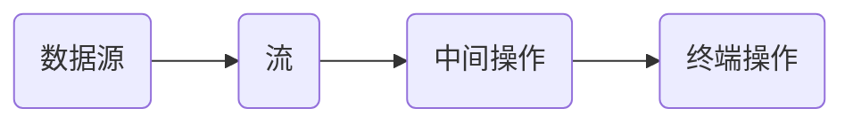
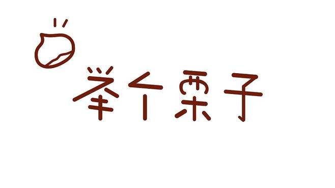

在review代码的过程中，经常看到一些代码能够使用stream的方式处理的更好，会建议同事使用stream。

stream 作为 Java 8 提供的 特性，过去这么多年了，但是在开发中有些程序小哥哥依然不愿意使用，觉得代码不够直白，宁愿多写一些for循环，但是历史证明新欢总比旧爱好，留下的都是优质的。不去接触，学习下新鲜事物，必将成为一个老古董 。只要你想下车撒泡尿，你就会被历史的车轮无情甩下，因为这是一趟高铁。你看新欢正在向你招手。

美女图片


### 1、为什么不愿意使用流

我认为有几方面的原因：

一是现在的for while 能解决问题，没必要

二是没有发现stream的好，不愿意使用。

三是自己没有抓住理解的核心，记忆起来很费劲，用起来不顺手。

### 2、理解流

流 如字面意思，顺序处理，最终产出结果。

我的理解，流和sql 有差不多的行为方式。对数据进行筛选，整合。



作为Java程序员一般都会知道如何写Sql,一个简单的sql 像下面这样：

```mysql
select * from table where 限制条件 group by 条件 limit 10 
从数据源中过滤出数据，进行分组，然后取一部分。
```

sql能做的事，流基本都能做。

### 3、举个例子



定义Player类的定义如下：

```java
/**
 * 玩家类 
 * 公众号：香菜聊游戏
 */
@AllArgsConstructor
public class Player {
    //  名字
    @Getter @Setter
    public String name;
    //  性别
    @Getter @Setter
    private int sex;
    //  年龄
    @Getter @Setter
    private int age;
    //  工资
    @Getter @Setter
    private int salary;

}

```


#### 1、过滤数据 ==>where

​		

```
  		//  过滤出年龄在18岁以上的所有人的名字
        List<Player> age18List = playerList.stream()
        .filter(player -> player.getAge() > 18)
        .collect(Collectors.toList());
```


#### 2、过滤字段 ==>也就是select 的列

```
				List<String> age18NameList = playerList.stream()
                .filter(player -> player.getAge() > 18)
                .map(Player::getName)
                .collect(Collectors.toList());
```


#### 3、分组，按性别分组 ==> group by


```
			Map<Integer, List<Player>> age18GroupMap = playerList.stream()
                .filter(Player -> Player.getAge() > 18)
                .collect(Collectors.groupingBy(Player::getSex));
```


#### 4、排序后取前两位 ==> limit

```
		//  过滤出年龄在18岁以上并且最小的2个
        List<Player> age18List = playerList.stream()
                .sorted(Comparator.comparingInt(Player::getAge))
                .limit(2)
                .collect(Collectors.toList());
```

#### 5、求和 ==> sum

```
			Integer age18SumSalary = playerList.stream()
                .map(Player::getSalary)
                .reduce(0,Integer::sum);
```


以上几个例子只是stream的一些举例，介绍了和sql 的相似性。只要你想到的都可以实现。sql不好实现的stream也可以实现。在学习的时候先了解，在使用的时候不清楚可以搜索一下，多用几次就熟练了，就掌握了。stream没有增加什么新的东西，只是新瓶装旧酒，不同的语法形式而已。

选择「爱我」还是「恨我」，这矛盾永远存在...
恨我，因为我华美的表演，我自信到狂妄
恨我，因为我精准的后仰跳投，我对胜利的热切渴望
恨我，因为我是个无所不能的老手，一个胜者
憎恨我吧，请用你身体中的每一个细胞来狠狠的憎恨我，憎恨我被同样执著的一群人所深爱着

居然和你的丝毫不差…

### 4、总结

stream让我们的代码更简洁，逻辑上更加顺畅，写更少的代码，做更多的事。stream 解开了代码细节和业务逻辑的耦合，表达的是"要做什么"而不是"如何去做"，可以更加专注于业务逻辑，写出易于理解和维护的代码。用sql的知识做类比，去完成对stream的认识，学习，知识迁移是我们学习的捷径，你掌握了吗？

有愿意加入分享的大佬联系我！！！

有不明白的可以私聊我，一起学习交流。

最后分享一本书 《JVM高级特性与最佳实践》，回复 JVM高级特性与最佳实践获取链接。

见过要饭的要早饭吗？他要是起得来就不用要饭了……--郭德纲


