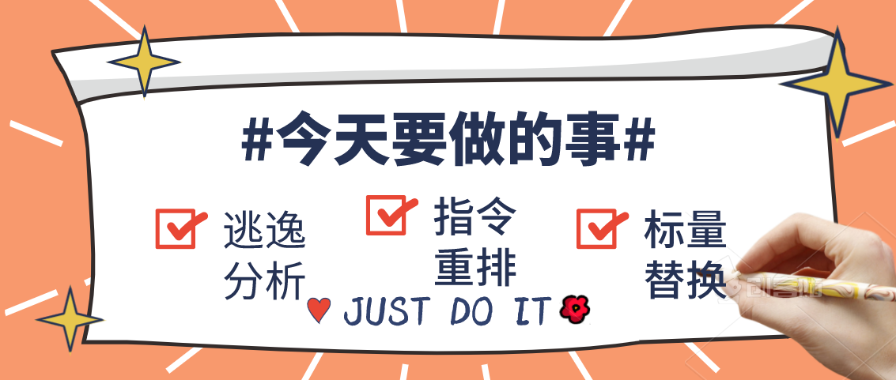

	

这篇其实计划了好久了，一直没动力写，今天回来的稍微早了一会，总结一下几个概念。

## 1、标量替换

​	首先要搞明白什么叫标量。所谓标量就是不可以进一步分解的量，如java中基本数据类型和reference类型，相对的一个数据可以继续分解，称为聚合量。因此 如果把一个对象拆散，将其成员变量恢复到基本类型来访问就叫做标量替换。标量替换的好处是避免了对象在堆上的分配，在栈上直接创建，提高了运行效率。

## 2、逃逸分析

逃逸分析确定某个指针可以存储的所有地方，以及确定能否保证指针的生命周期只在当前进程或在其它线程中。离开了就说明他逃逸了。

逃逸分析包括：

1. 全局变量赋值逃逸：变量赋值给全局变量；

2. 方法返回值逃逸：变量作为方法的返回值；

3. 实例引用发生逃逸：变量作为方法的入参；

4. 线程逃逸：赋值给类变量或可以在其他线程中访问的实例变量；

    ```
    public String wrapString(String ... paramArr){
            StringBuffer sb = new StringBuffer();
            for (String string : paramArr) {
                sb.append(string+",");
            }
            return sb.toString();
        }
    ```

    上述代码中，stringBuffer变量的作用域只存在于createString方法中，不会发生逃逸，可以进行栈上分配。

## 3、指令重排

 在执行程序时，为了提高性能，编译器和处理器常常会对指令做重排序。重排序分3种类型：

1. 编译器优化的重排序。编译器在**不改变单线程程序语义**的前提下，可以重新安排语句的执行顺序。

2. 指令级并行的重排序。现代处理器采用了指令级并行技术（Instruction-Level Parallelism，ILP）来将多条指令重叠执行。如果不存在**数据依赖性**，处理器可以改变语句对应机器指令的执行顺序。

3. 内存系统的重排序。由于处理器使用缓存和读/写缓冲区，这使得加载和存储操作看上去可能是在乱序执行。

    ```
            double a  = 3.14;    //A
            double b   = 1.0;     //B
    ```

     故在单线程情况下， A与B的指令顺序是可以重排的。

    ```
        int a = 0;
        boolean flag = false;
    
        public void writer() {
            a = 1;                   //1
            flag = true;             //2
        }
    
        public void reader() {
            if (flag) {                //3
                int i =  a * a;        //4
            }
        }
    ```

    单线程的情况下 a 和 flag 重排， 执行顺序是固定的，不影响结果。指令重排的情况下，可能就会不一样的结果。

    volidate 可以禁止指令重排。

## 4、CAS

cas是compare and swap的简称，从字面上理解就是比较并更新，简单来说：从某一内存上取值V，和预期值A进行比较，如果内存值V和预期值A的结果相等，那么我们就把新值B更新到内存，如果不相等，那么就重复上述操作直到成功为止。

上面我们了解了cas是什么了，那么它能解决什么问题呢？它可以解决多线程并发安全的问题，以前我们对一些多线程操作的代码都是使用synchronize关键字，来保证线程安全的问题；现在我们将cas放入到多线程环境里我们看一下它是怎么解决的，我们假设有A、B两个线程同时执行一个int值value自增的代码，并且同时获取了当前的value，我们还要假设线程B比A快了那么0.00000001s，所以B先执行，线程B执行了cas操作之后，发现当前值和预期值相符，就执行了自增操作，此时这个value = value + 1;然后A开始执行，A也执行了cas操作，但是此时value的值和它当时取到的值已经不一样了，所以此次操作失败，重新取值然后比较成功，然后将value值更新，这样两个线程进入，value值自增了两次，符合我们的预期。

可以看下 	AtomicInteger 类的实现。

## 5、GcRoot

在gc中，从“GC Roots”对象开始向下搜索，如果一个对象到“GC Roots”没有任何引用链相连，说明此对象可以被回收。垃圾回收器回收那些不是 GC Roots 的对象并且不再被GC Roots引用的对象。

​	在java语言中，可作为GCRoot的对象包括以下几种：

  **a.** java虚拟机栈(栈帧中的本地变量表)中的引用的对象。 

  **b**.方法区中的类静态属性引用的对象。 

  **c**.方法区中的常量引用的对象。 

  **d**.本地方法栈中JNI本地方法的引用对象。


## 总结： 

上面总结了一些概念，也只是简单的介绍下，感兴趣的可以继续深入的了解下。

## 