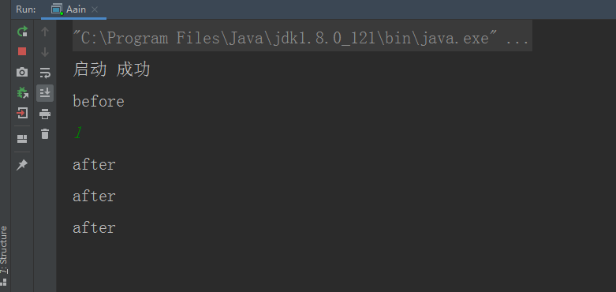

一直在写基础篇，本来想按顺序来，但是想想无所谓了，只要是计划内的就好，今天聊一下热更新。

## 1、热更新的存在合理性

​	由于游戏开发的节奏很快，加上策划的美其名调整，整天瞎鸡儿改，又经常熬夜加班，所以代码质量相对来说就会低一些，程序经常出现一些bug。尤其是线上问题，如果出现刷资源，刷道具的bug，将会对游戏的平衡性是严重的打击，所以所有出现影响游戏流水的bug都是S级的bug。但是出现问题了就得解决问题，众所周知客户端可以发布补丁，游戏再次启动就好了，客户端的重启只是影响一个玩家，但是服务端重启是影响一个服的所有玩家，问题来了：服务端如何在不停服的情况下解决问题？热更新！！！

## 2、热更新的局限性

​	热更新不是万能的，因为程序没办法重启，所以有一些事情做不了，比如：重启应用，哈哈，主要有下面几个限制。

1. 函数签名不能修改，只能修改函数内部的逻辑。

2. 不能增加或者减少类的函数或变量。

3. 函数必须能够退出，如果有函数在死循环中，无法执行更新类（笔者实验发现，死循环跳出之后，再执行类的时候，才会是更新类）

**简单来说：只能修改函数逻辑。**

   

## 3、Java提供了的Instrumentation

 Instrumentation 的最大作用 **替换和修改某些类的定义**。

- 有两种获取`Instrumentation`接口实例的方法： 
    1. 当以指定JavaAgent的方式启动JVM时。 在这种情况下， `Instrumentation`实例被传递给代理类的`premain`方法。 
    2. 当JVM在JVM启动后的某个时间提供启动JavaAgent时。 在这种情况下， `Instrumentation`实例将传递给代理代码的`agentmain`方法。 

​	如何定义JavaAgent？首先看清单文件：
```
Manifest-Version: 1.0
Premain-Class: com.pdool.GamWatcherPreMain
Agent-Class: com.pdool.GamWatcherAgentMain
Can-Retransform-Classes: true
Can-Redefine-Classes: true

```
Agent-Class是通过attach的方式调用的类。


```
package com.pdool;

import java.lang.instrument.Instrumentation;

public class GamWatcherAgentMain {
    public static void agentmain(String options, Instrumentation ins) {
        Spy.spy = ins;
        System.out.println("attach成功");
    }
}

```
Premain-Class是通过启动参数的方式调用的类
```
package com.pdool;

import java.lang.instrument.Instrumentation;

public class GamWatcherPreMain {
    public static void premain(String options, Instrumentation ins) {
        Spy.spy = ins;
        System.out.println("启动 成功");
    }
}

```
生成自己的jar,然后在vm 参数后增加

```
-javaagent:D:\wechat\GamWatcherAgent\out\artifacts\GamWatcherAgent_jar\GamWatcherAgent.jar
```


下面模拟线上环境，首先是主线程：

```
public class MainThread extends Thread {

    @SneakyThrows
    @Override
    public void run() {
        while (true){
            TestHotSwap.print();
            Thread.sleep(3*1000);
        }
    }
}
```

然后是热更新线程，热更新线程会在控制台输入1 的时候进行加载更新类。

redefineClasses(classDefinition); 需要一个参数ClassDefinition,

ClassDefinition 的构造需要class 和二进制数组，前者表示原来的class，后者表示新的class 二进制。

```
import com.pdool.Spy;
import lombok.SneakyThrows;

import java.io.BufferedInputStream;
import java.io.FileInputStream;
import java.lang.instrument.ClassDefinition;
import java.util.Scanner;

public class RedefineThread extends Thread {
    Scanner scanner;
    public RedefineThread() {
        scanner = new Scanner(System.in);
    }

    @SneakyThrows
    @Override
    public void run() {
        while ( true){
            int i = scanner.nextInt();
            if (i == 1){
                Class<?> testHotSwap = Class.forName("TestHotSwap");
                BufferedInputStream bis = new BufferedInputStream(new FileInputStream("D:\\wechat\\arthas\\demo\\target\\classes\\TestHotSwap.class"));
                int len = bis.available();
                byte []b = new byte[len];
                bis.read(b, 0, len);
                ClassDefinition classDefinition = new ClassDefinition(testHotSwap, b);
                Spy.spy.redefineClasses(classDefinition);
            }
        }
    }
}

```

想要热更的类：热更前

```
public class TestHotSwap {
    public static  void print(){
        System.out.println("before");
    }
}

```

热更后：

```
public class TestHotSwap {
    public static  void print(){
        System.out.println("after");
    }
}

```

启动测试：

```
/**
 * 微信公众号：gamWatcher
 */
public class Aain {
    public static void main(String[] args) throws Exception {
        MainThread mainThread = new MainThread();
        RedefineThread redefineThread = new RedefineThread();
        mainThread.start();
        redefineThread.start();
    }
}

```



可以看到，代码已经被更新成新的代码。代码热更新完成。

## 总结：

 热更新并不难，难的是没有思路，看了上面的代码，应该有所觉悟，哪有那么高深，不过是使用现成的接口而已。拿去装逼，不谢。

有一个问题大家可以思考一下，为什么我在宿主程序内可以使用javaagent内对象的属性？大家可以留言给我。

原创不易，求关注点赞，谢谢。