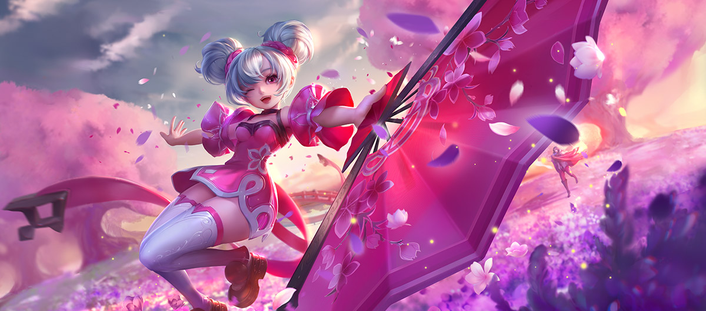
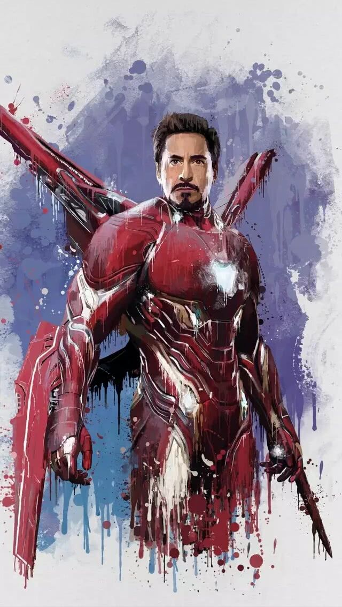
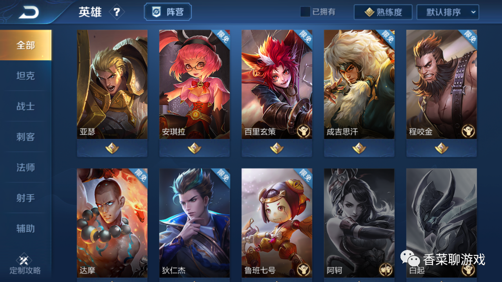
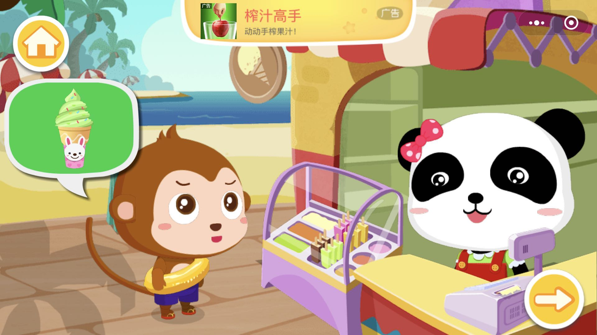
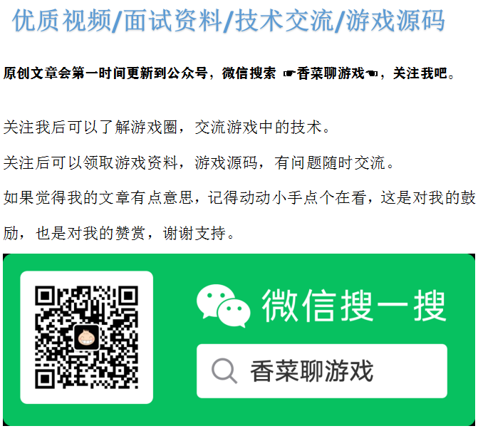

你以为在白嫖王者荣耀，其实是腾讯白嫖了你

最近一直在写Java干货系列，是因为做了大纲，一直有计划的进行，比较欣慰的是获得了CSDN的认可，但是荒废了自己一直想写的游戏系列，因为在游戏行业这么不长不短的时间，总有一些东西想要聊聊，要分享。今天就抽空说一下到底零氪玩家对于游戏公司来说意味着什么，稍微分析一下，且听我胡扯一番。

大部分游戏都是非肝即氪，要么充值，要么花时间，时间和金钱必须有所付出，对于游戏公司来说，氪金玩家是亲爸爸，非氪金玩家是可能成为爸爸的人，也不能忽视，因为不充钱不代表不能创造价值，下面就从几个方面聊聊不花钱玩家对于游戏公司的重要性。

### 1、品牌价值。

​	文化产业最值钱的是IP，如果能打造自己的IP，就能保持公司一直坚挺。就像漫威拥有大量的超级英雄IP，任何一个拿出来都是大把的钱，《复联4》钢铁侠一个人的片酬就过亿美元，这就是IP的力量。今天玩家不花钱，但是培养了一批玩家。就像周星驰电影上映时，多少人哭着喊着说我们欠星爷一张电影票。拥有了IP就可以开发周边产品，比如漫画，电影等等形其他形式。

### 2、传播价值

​	现在大部分的游戏都有游戏分享这个玩法，官方通过送一些奖励，引导玩家进行分享，分享到朋友圈，分享到各种渠道。比如一起来捉妖的分享，朋友圈朋友看到后会关注这个游戏，在无形中就帮游戏做了广告，帮游戏节省了一部分广告费。

### 3、维持游戏活跃度

​	游戏内的人气是很重要的，如果一个游戏服务器只有1个活跃玩家，这样的游戏是没有人愿意充值，维持游戏的活跃度对于游戏运营商来说很重要。比如王者荣耀需要匹配用户，十个人的玩法，如果游戏内活跃度不够，匹配不到人或者等很久才能匹配到，你还会玩吗？估计早就脱坑了，没人了，游戏也就死了，还想什么充值？

### 4、潜在的付费用户

​	零氪用户不代表以后不会充值，如何挖掘潜在的付费用户，也是促进游戏开发的重要课题，如果一个玩家不愿意为游戏充值，只能说游戏还是不够好。多少人看罗永浩的直播声称是为理想主义充值，如果游戏做的好，玩家也愿意为游戏买单。

### 5、广告收入

​	 互联网的很多公司都是用户不用充值的，比如360，打败付费杀毒软件的利器就是免费，360靠着其他的业务成长起来了，比如广告，app渠道，其他的产品付费养活了公司。不充钱不代表不能创造价值。现在很多游戏都接入了广告，最显而易见的就是微信小游戏，免费，但是下面的广告为开发商产出了收益。

### 6、产生贫富对比

​	变得更好是充值的原始动力，有种不太好的说法，说免费玩家就是付费玩家的游戏内道具，这句话你品，你细品！有那么点道理，没有不充钱的玩家对比，大R玩家怎么装X，不能装X谁愿意充钱。

总结：有钱捧个钱场，没钱捧个人场呗。常来玩就挺好的。

每日一句

曾经执剑利于江湖，此刻混迹于市井之间——种鑫

